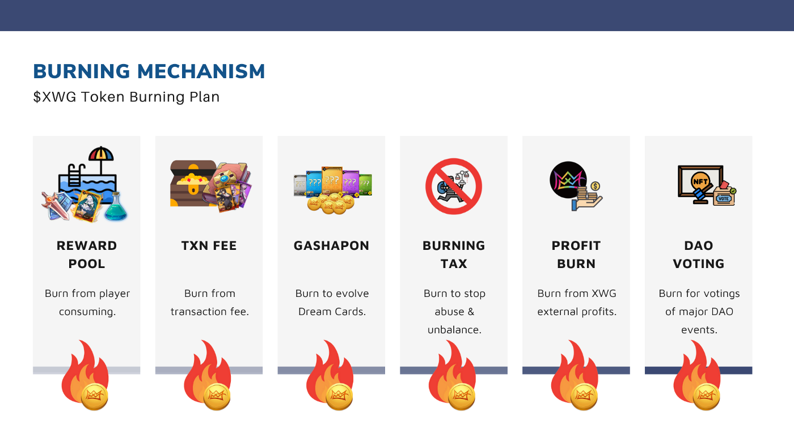

# Burning Mechanism

****

<figure><figcaption></figcaption></figure>

**LuckyFi World Games** is excited to introduce our future plans for the $FLI token. In this outline, we will describe some of the existing measures and burning mechanisms we have designed, and our future plans for burning $FLI tokens. With these token-burning mechanisms, we will improve the **LuckyFi World Games** ecosystem and the future volatility of the $FLI token.

### TLDR; 

1. $FLI token burning and NFT burning will be upgraded and introduced into our ecosystem in the future. Token burning will happen to a portion of our recycled $FLI and when $FLI is received through transaction fees.
2. A Burning Tax will be implemented to limit abusive behaviors and a “Loot Box” style mechanism will allow players to burn their $FLI and NFTs for a chance to receive exclusive rewards.
3. In the future, X **LuckyFi World Games**ill announce token burning on outside revenue streams by swapping a fixed portion (_**50% profit**_) of the quarterly profit to $FLI to burn. As well as implementing DAO governance burning mechanisms to require players to burn $FLI to vote on specific DAO events.
4. The Burning Address will be announced soon and the total burning amount will be announced _**quarterly**_.
5. The max cap of burning will be _**44%**_ of the total supply. All burnt amounts of $FLI will be removed from the circulation.

### How is “Token Burning” Positive? 

The positive output of token burning benefits the project and token holders. Token burning helps with stabilizing the value of a coin and minimizing the risk of potential price inflation. By burning $FLI tokens and reducing the supply of $FLI in circulation, we will improve the stability of the coin and the **LuckyFi World Games** ecosystem.

## Our “Burning” Plans to Come

### **Upgrades to our Pool systems** 

Our existing Recycle Pool, made up of a combination of NFTs v1 & v2 card upgrades and equipment purchases, is currently designed to circulate $FLI back into our ecosystem and into our Rewards Pool. We plan to upgrade and design a system where a portion of our pool is to be burned monthly or quarterly, while a portion of the recycled $FLI will be set aside to be used for future rewards pools or lottery pool allocations.

**Our Burning address wallet:** [https://bscscan.com/token/0x6b23c89196deb721e6fd9726e6c76e4810a464bc?a=0x00f891847537f95164c26284e4ec9d27cd4c535b](https://bscscan.com/token/0x6b23c89196deb721e6fd9726e6c76e4810a464bc?a=0x00f891847537f95164c26284e4ec9d27cd4c535b)

### **Implementing Transaction Fee Token Burning** 

We will be upgrading our current existing transaction fee to include token burning. For example, when exchanging NFTs on our platform or opening loot boxes in-game, our existing transaction fee for the event will be upgraded. Our plan will be to upgrade by issuing a portion of that transaction fee to be automatically sent to our token-burning wallet address. This % of $FLI, _**estimated to be 50%-70%**_, will be designated to be burned and will be removed from circulation.

### **Dream Card NFTs and Token Burning** 

To be developed and announced, $FLI will work to upgrade our ecosystem by introducing Dream Card NFT and $FLI token burning for rewards. Similar to your standard “Loot Box” or “Gachapon Ticket”, players will be able to choose to burn a combination of their tokens or NFTs in order to receive a randomly generated Dream Card hero with randomly generated stats. A secret combination of the two burning mechanisms will also give players the chance to combine their NFTs and $FLI to burn and receive an exclusive Dream Card Hero evolution.

### **Burning Tax** 

**LuckyFi World Games** is determined on building an ecosystem that can welcome all players and deter the misuse of our ecosystem. We look to improve and reduce the acts of abusive behaviors by implementing a Burning Tax to subside misuse and rebalance our ecosystem. Our Burning Tax will be implemented periodically or on specific events where misuse has taken place, this will solely be dependent on where we need to address and decrease abusive behaviors.

## Our Future “Burning” Plans

### **Profit Burn** 

**LuckyFi World Games** is set to partner up and integrate with many third-party companies to build and developed various market verticals in the gaming and entertainment industry.  We have many future partnerships plans to come. With those additional avenues of revenue, $FLI will experience an influx of profit coming from outside of our Play to Earn ecosystem.

**LuckyFi World Games** plans to use this influx to keep our ecosystem balanced by implementing a burning mechanism that swaps _**50%**_ of the quarterly profit to $FLI, which then burns those tokens. The amount of burnt $FLI coming from such profit will be announced each quarter.

### DAO and Burning 

To be developed in the future. We look to upgrade our DAO governance system by incorporating burning mechanisms into the voting system. Selected DAO events will require participants to burn $FLI tokens in order to receive their voting NFT, which will be a DAO event-specific NFT that will allow you to vote. This voting NFT will also be similar to a Proof of Attendance Protocol (POAP), a digital badge that is collectible, and your proof of participation in the DAO event. With this voting NFT, DAO participants will use it to stake their vote!

## All in All 

**LuckyFi World Games** will introduce many forms of burning mechanisms into our $FLI ecosystem. We are excited about how this will solidify and strengthen our project by bringing stability and balance to our $FLI token. The future and volatility of $FLI are bright!

_`Disclaimer: Due to unforeseen circumstances and possible economic impacts, X World Games reserves the right to change, modify, revoke, add or remove any of the terms from the burning plan at any time with notice`_
